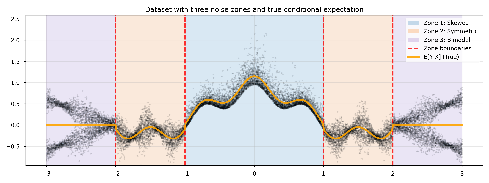
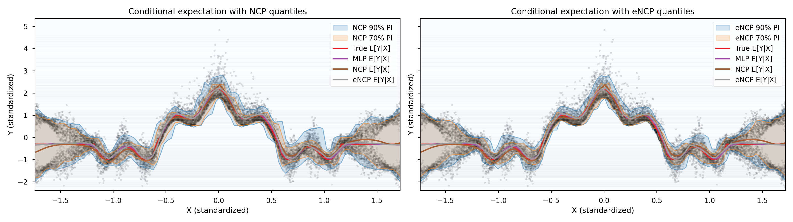
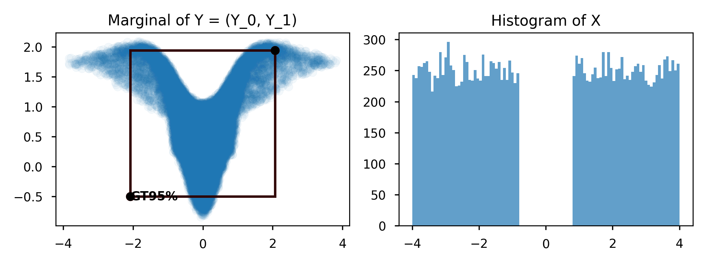
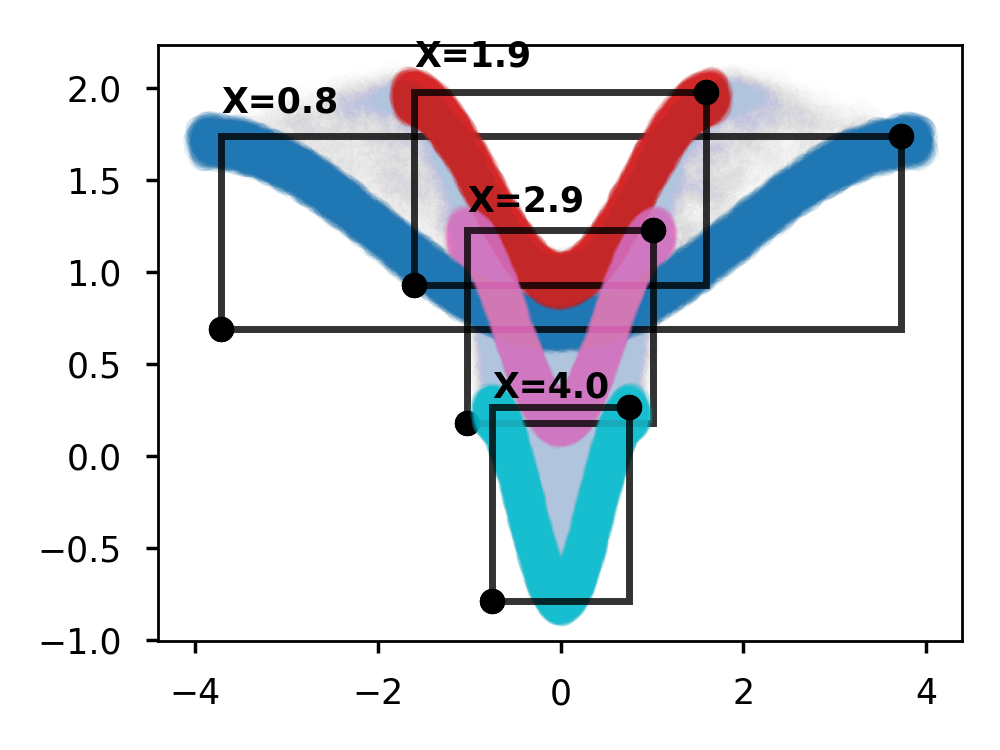
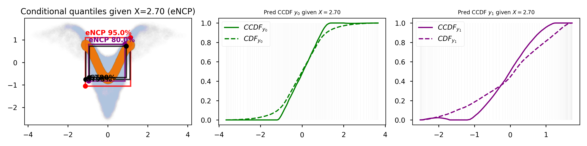

# Representation Learning for Equivariant Inference with Guarantees

This repository hosts the code of the paper "Representation Learning for Equivariant Inference with Guarantees" submitted to ICLR 2026.

<!-- **Authors:** Daniel Ordoñez-Apraez, Vladimir Kostić, Alek Fröhlich, Vivien Brandt, Karim Lounici, Massimiliano Pontil -->

## Installation

The repository holds a python package named `symm_rep_learn` that implements the models and baselines described in the paper, with ready-to-import modules for third party development. To install the core library do:

```bash
pip install -e .
```
Additional depdendencies for plotting, logging and visualization are needed to run the experiments and notebooks in the `paper/` folder. If you want to run these, please install the optional dependencies with:

```bash
pip install -e ".[paper]"
```

## Repository Structure

```
.
├── symm_rep_learn/              # Core library
│   ├── inference/               # Inference-time modules (e.g., cCDF estimation, conditional quantile regression)
│   ├── models/                  # Model implementations  (eNCP, NCP, baselines)
│   ├── nn/                      # Neural network components
│   └── mysc/                    # Utilities and theory
├── paper/                       # Paper experiments and examples
    ├── examples/                # Reproducible examples
    ├── experiments/             # Main experiments
    ├── plots/                   # Generated plots and figures
    └── results/                 # Experimental results
```

## Ready-to-use models

- [`ENCP` (Equivariant Neural Conditional Probability)](symm_rep_learn/models/neural_conditional_probability/encp.py#L22) extends the neural conditional operator with equivariant embeddings and statistics so that conditional expectations respect symmetry constraints.
- [`NCP` (Neural Conditional Probability)](symm_rep_learn/models/neural_conditional_probability/ncp.py#L16) is the base operator that learns low-rank factorizations of conditional expectations and exposes helpers such as [`conditional_expectation`](symm_rep_learn/models/neural_conditional_probability/ncp.py#L164) and [`fit_linear_decoder`](symm_rep_learn/models/neural_conditional_probability/ncp.py#L186) for regression tasks.

### Inference modules

- [`ENCPConditionalCDF`](symm_rep_learn/inference/conditional_quantile_regression/encp.py#L12) Uses a trained ENCP to perform symmetry-aware conditional CDF (cCDF) estimation and conditional quantile regression.
- [`NCPConditionalCDF`](symm_rep_learn/inference/conditional_quantile_regression/ncp.py#L12) Uses a trained NCP to perform cCDF estimation and conditional quantile regression.

## Reproducible examples

### Conditional expectation (regression) with uncertainty quantification

We demonstrate conditional expectation (regression) *with uncertainty quantification* in the notebook [conditional_expectation_regression_1D.ipynb](paper/examples/conditional_expectation_regression/conditional_expectation_regression_1D.ipynb). The notebook tackles a picewise 1D regression where we aim to predict both the expected value of `Y` given `X` and confidence intervals (lower and upper quantiles) for the prediction. Confidence intervals are of paramount importance in the regions where the conditional distribution $\mathbb{P(y \mid x)}$ is multimodal or skewed.



The notebook illustrates how to use the eNCP and NCP models to estimate conditional expectations (regression) and conditional quantiles (uncertainty quantification), without any retraining needed for estimation of quantiles of different coverage levels.


### Conditional quantile regression

The notebook [conditional_quantile_regression_synthetic.ipynb](paper/examples/conditional_quantile_regression/conditional_quantile_regression_synthetic.ipynb) how the eNCP and NCP framework *model conditional probabilities* enabling the prediction of the conditional [Cumulative Distribution Function](https://en.wikipedia.org/wiki/Cumulative_distribution_function) (cCDF) enabling the regression of conditional quantiles of any desired coverage level.
<p float="left">
  
  
</p>
The results show how the eNCP and NCP models outperform training frameworks that aim to directly predict quantiles of a fixed coverage level (i.e., Conditional Quantile Regression, CQR)



## Baseline implementations

- [`CQR` (Conditional Quantile Regression)](symm_rep_learn/models/conditional_quantile_regression/cqr.py#L5) implements the standard two-head pinball-loss baseline.
- [`eCQR` (Equivariant Conditional Quantile Regression)](symm_rep_learn/models/conditional_quantile_regression/ecqr.py#L10) wraps equivariant MLPs to enforce symmetry-aware prediction intervals.
- [`DRF` (Density Ratio Fitting)](symm_rep_learn/models/density_ratio_fitting/drf.py#L6) provides density-ratio based estimators of pointwise mutual dependency.
- [`InvDRF` (Invariant Density Ratio Fitting)](symm_rep_learn/models/density_ratio_fitting/inv_drf.py#L12) adapts DRF to invariant equivariant modules for symmetry-preserving density-ratio estimation.

## Citation

If you find this work useful in your research, please consider citing:

```bibtex
@article{ordonez2025eNCP,
  title={Representation Learning for Equivariant Inference with Guarantees},
  author={Ordo{\~n}ez-Apraez, Daniel and Kosti{\'c}, Vladimir and Fr{\"o}hlich, Alek and Brandt, Vivien and Lounici, Karim and Pontil, Massimiliano},
  journal={arXiv preprint arXiv:2505.19809},
  year={2025}
}
```
