# Representation Learning for Equivariant Inference with Guarantees

This repository hosts the code of the paper "Representation Learning for Equivariant Inference with Guarantees".


## Installation

The repository holds a python package named `symm_rep_learn` that implements the models and baselines described in the paper, with ready-to-import modules for third party development. To install the core library do:

```bash
pip install -e .
```
Additional depdendencies for plotting, logging and visualization are needed to run the experiments and notebooks in the `paper/` folder. If you want to run these, please install the optional dependencies with:

```bash
pip install -e ".[paper]"
```

## Repository Structure

```
.
├── symm_rep_learn/              # Core library
│   ├── inference/               # Inference-time modules (e.g., cCDF estimation, conditional quantile regression)
│   ├── models/                  # Model implementations  (eNCP, NCP, baselines)
│   ├── nn/                      # Neural network components
│   └── mysc/                    # Utilities and theory
├── paper/                       # Paper experiments and examples
    ├── examples/                # Reproducible examples
    ├── experiments/             # Main experiments
    ├── plots/                   # Generated plots and figures
    └── results/                 # Experimental results
```

## Ready-to-use models

- [`ENCP` (Equivariant Neural Conditional Probability)](symm_rep_learn/models/neural_conditional_probability/encp.py#L22) extends the neural conditional operator with equivariant embeddings and statistics so that conditional expectations respect symmetry constraints.
- [`NCP` (Neural Conditional Probability)](symm_rep_learn/models/neural_conditional_probability/ncp.py#L16) is the base operator that learns low-rank factorizations of conditional expectations and exposes helpers such as [`conditional_expectation`](symm_rep_learn/models/neural_conditional_probability/ncp.py#L164) and [`fit_linear_decoder`](symm_rep_learn/models/neural_conditional_probability/ncp.py#L186) for regression tasks.

### Inference modules

- [`ENCPConditionalCDF`](symm_rep_learn/inference/conditional_quantile_regression/encp.py#L12) Uses a trained ENCP to perform symmetry-aware conditional CDF (cCDF) estimation and conditional quantile regression.
- [`NCPConditionalCDF`](symm_rep_learn/inference/conditional_quantile_regression/ncp.py#L12) Uses a trained NCP to perform cCDF estimation and conditional quantile regression.

## Reproducible examples

### 1. Conditional expectation (regression) with uncertainty quantification

We demonstrate conditional expectation (regression) *with uncertainty quantification* in the notebook [conditional_expectation_regression_1D.ipynb](paper/examples/conditional_expectation_regression/conditional_expectation_regression_1D.ipynb). The notebook tackles a picewise 1D regression where we aim to predict both the expected value of `Y` given `X` and confidence intervals (lower and upper quantiles) for the prediction. Confidence intervals are of paramount importance in the regions where the conditional distribution $\mathbb{P}(y \mid x)$ is multimodal or skewed.

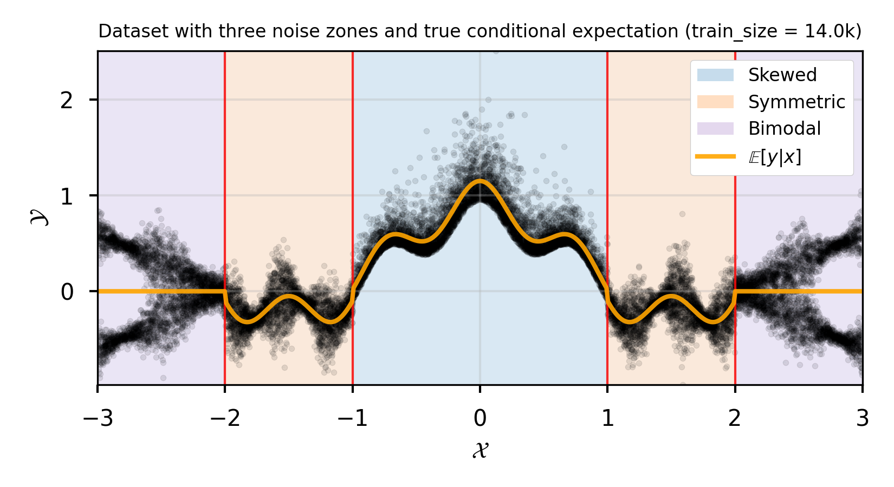

The notebook illustrates how to use the eNCP and NCP models to estimate conditional expectations (regression) and conditional quantiles (uncertainty quantification), without any retraining needed for estimation of quantiles of different coverage levels.
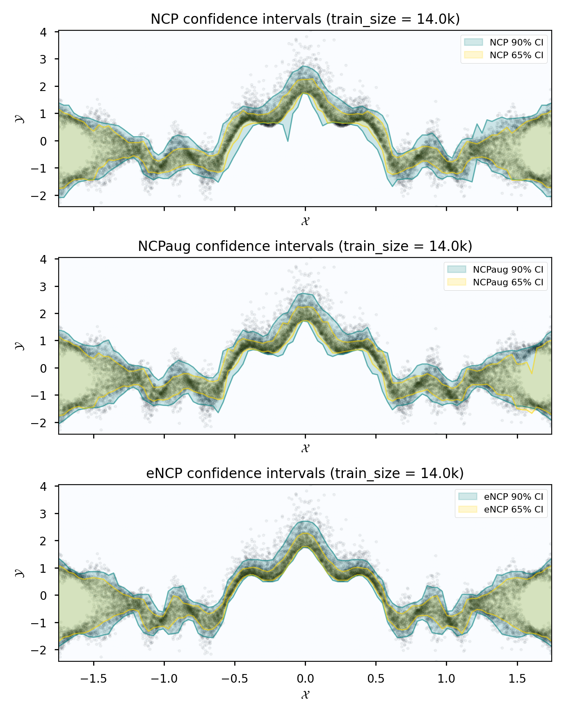
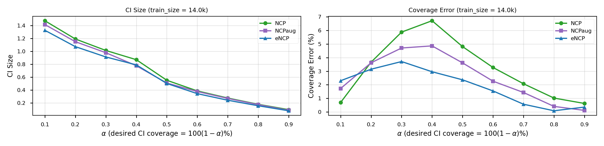

### 2. Conditional quantile regression

The notebook [conditional_quantile_regression_synthetic.ipynb](paper/examples/conditional_quantile_regression/conditional_quantile_regression_synthetic.ipynb) shows how the eNCP and NCP framework *model conditional probabilities* enabling the prediction of the conditional [Cumulative Distribution Function](https://en.wikipedia.org/wiki/Cumulative_distribution_function) (cCDF) enabling the regression of conditional quantiles of any desired coverage level.
<p float="left">
  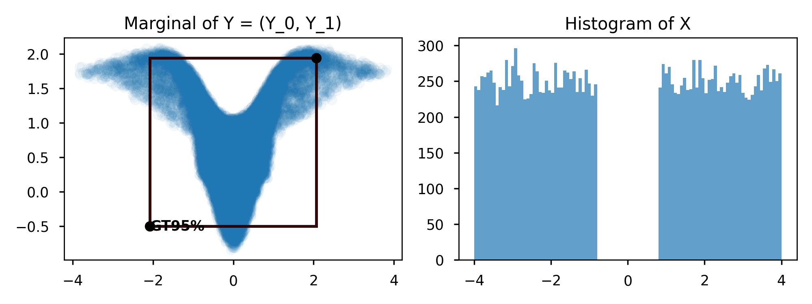
  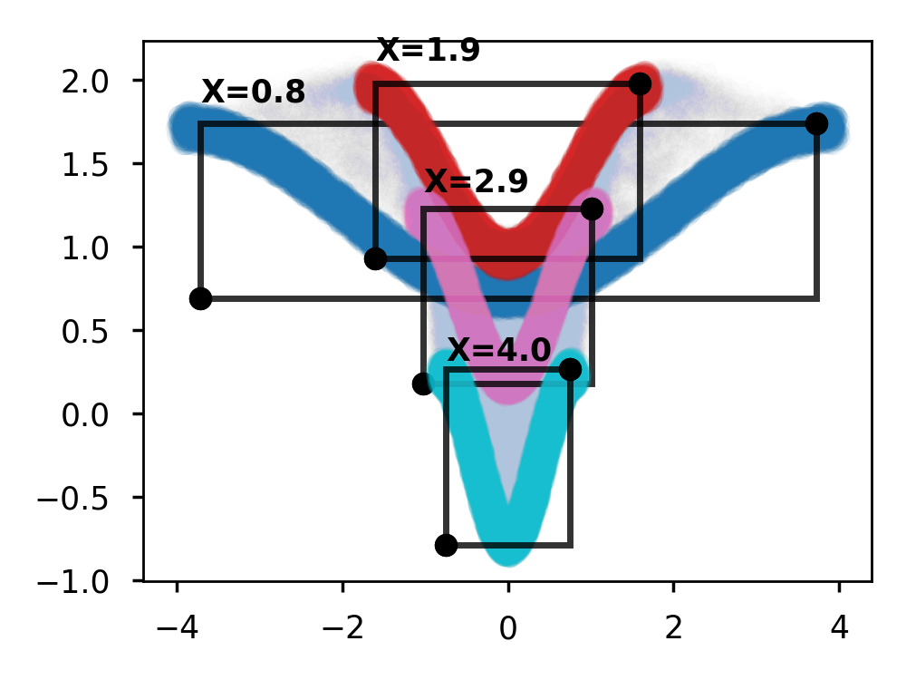
</p>
The results show how the eNCP and NCP models outperform training frameworks that aim to directly predict quantiles of a fixed coverage level (i.e., Conditional Quantile Regression, CQR)

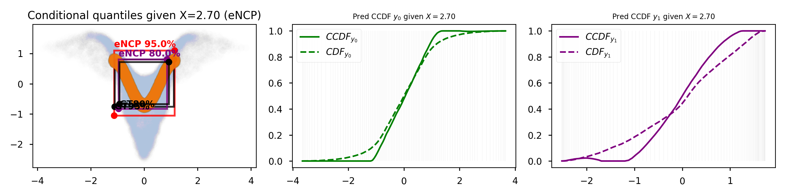

### 3. Uncertainty quantification in ground reaction force estimation in legged locmotion

The notebook [conditional_quantile_regression_quadruped.ipynb](paper/examples/conditional_quantile_regression/conditional_quantile_regression_quadruped.py.ipynb) shows how the eNCP and NCP framework can be used for uncertainty quantification in the estimation of ground reaction forces (GRFs) in quadruped locomotion over rough terrain.

<div align="center">
    
   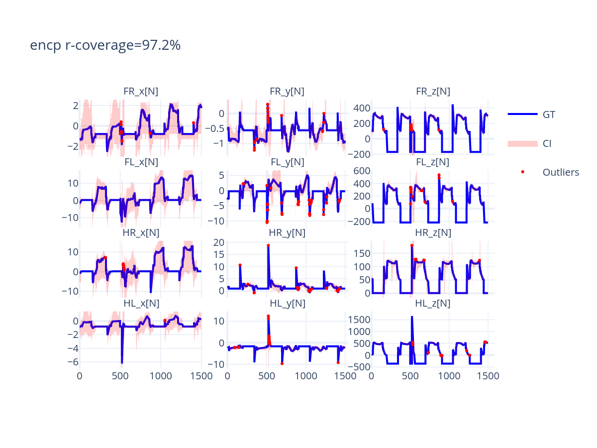
</div>

### 4. Sensitivity analysis to symmetry misspecification

The notebook [misspecified_sensitivity_analysis_1D.ipynb](paper/examples/misspecified_sensitivity_analysis/misspecified_sensitivity_analysis_1D.ipynb) studies robustness to symmetry-prior misspecification in the same 1D synthetic setup of experiment (1). Crucially we test he scenarios of incorrect and extrinsic misspecification follwing the taxonomy of [Wang et al. (2023)](https://proceedings.neurips.cc/paper_files/paper/2023/hash/7dc7793c89b93887e126a86f22ef63c6-Abstract-Conference.html).

1. **Extrinsic misspecification of $P_{x}$ $\mathbb{G}$-invariance**:
    This scenario corresponds to the case in the assumption of the $\mathbb{G}$-invariance of the marginal distribution of $\mathbf{x}$ is violated, because the support of the random variable in the training/val/test sets is not $\mathbb{G}$-invariant, meaning the empirical distribution of $\mathbf{x}$ is biased to a subset of the support of $P_{x}$. We test this scenario by training on a biased half-space ($x>0$) and evaluating performance on the biased and full support ($x>0$ and $x \in \mathbb{R}$).

    <div align="center">
      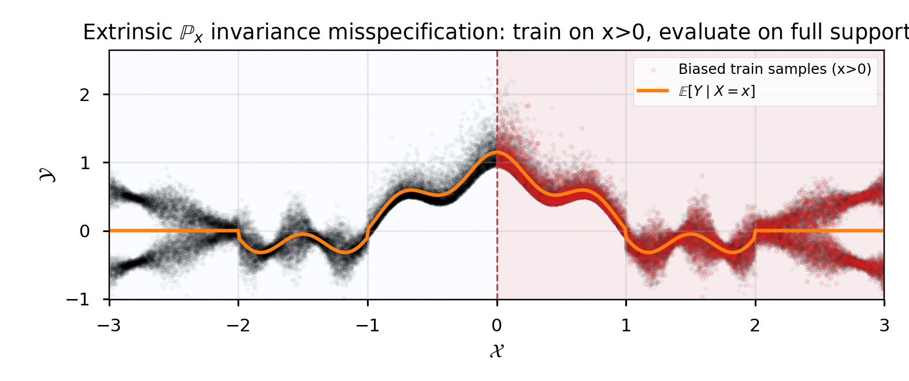
    </div>

    In these scenarios, the assumption of $\mathbb{G}$-invariance of $P_{x}$ and the use of the eNCP model serve as a regularization that enables o.o.d generalization without hampering the model's performance on the biased support.
2. **Incorrect misspecification of $P_{\mathbb{y} \mid \mathbf{x}}$ $\mathbb{G}$-invariance**:
    This scenario corresponds to the case in which the assumption of $\mathbb{G}$-equivariance of the conditional distribution of $\mathbf{y}$ given $\mathbf{x}$ is violated on a subset of the support of $\mathbf{x}$. We test two types of inccorrect misspecification:
    - **Unbiased incorrect misspecification**: Where we progressively scale the heteroscedastic noise amplitude on the region $x>1$, thus violating the $\mathbb{G}$-invariance of $P_{\mathbf{y} \mid \mathbf{x}}$ but preserving the $\mathbb{G}$-equivariance of the conditional expectation $\mathbb{E}[\mathbf{y} \mid \mathbf{x}]$.

    <div align="center">
      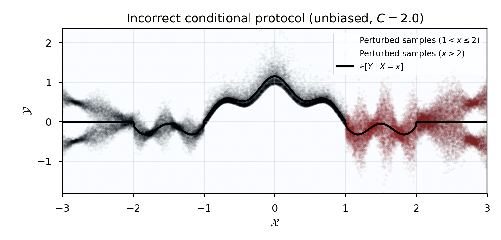
      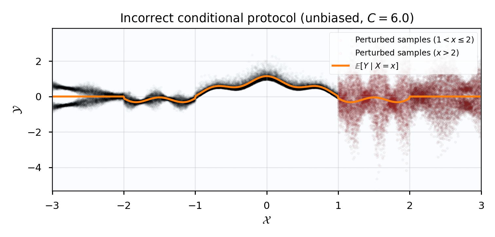
    </div>

    - **Biased incorrect misspecification**: Where we progressively add a linear biased on the region $x>1$, thus violating both the $\mathbb{G}$-invariance of $P_{\mathbf{y} \mid \mathbf{x}}$ and the $\mathbb{G}$-equivariance of the conditional expectation $\mathbb{E}[\mathbf{y} \mid \mathbf{x}]$, on the subset $|x|>1$.
    <div align="center">
      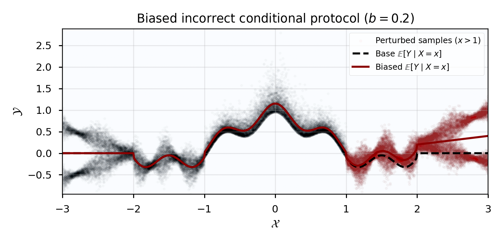
      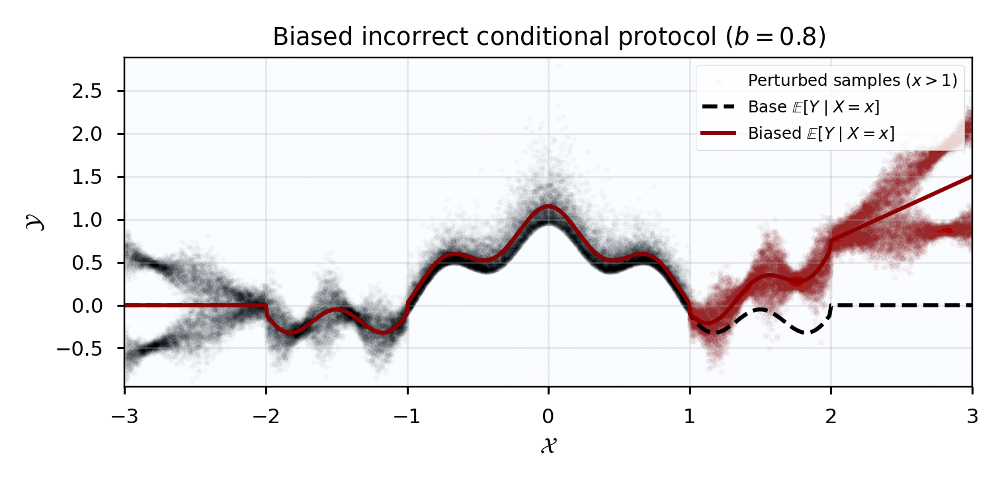
    </div>

The results, show that the performance of the eNCP model deteriorates continuously with the degree of misspecification

## Baseline implementations

- [`CQR` (Conditional Quantile Regression)](symm_rep_learn/models/conditional_quantile_regression/cqr.py#L5) implements the standard two-head pinball-loss baseline.
- [`eCQR` (Equivariant Conditional Quantile Regression)](symm_rep_learn/models/conditional_quantile_regression/ecqr.py#L10) wraps equivariant MLPs to enforce symmetry-aware prediction intervals.
- [`DRF` (Density Ratio Fitting)](symm_rep_learn/models/density_ratio_fitting/drf.py#L6) provides density-ratio based estimators of pointwise mutual dependency.
- [`InvDRF` (Invariant Density Ratio Fitting)](symm_rep_learn/models/density_ratio_fitting/inv_drf.py#L12) adapts DRF to invariant equivariant modules for symmetry-preserving density-ratio estimation.
