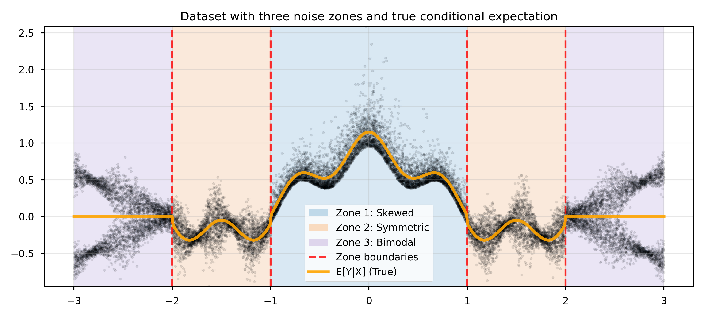

# Representation Learning for Equivariant Inference with Guarantees

This repository hosts the code of the ICLR 2026 submission 

<!-- **Authors:** Daniel Ordoñez-Apraez, Vladimir Kostić, Alek Fröhlich, Vivien Brandt, Karim Lounici, Massimiliano Pontil -->

## Installation

```bash
pip install -e .
```

## Ready-to-use models 

- [`ENCP` (Equivariant Neural Conditional Probability)](symm_rep_learn/models/neural_conditional_probability/encp.py#L22) extends the neural conditional operator with equivariant embeddings and statistics so that conditional expectations respect symmetry constraints.
- [`NCP` (Neural Conditional Probability)](symm_rep_learn/models/neural_conditional_probability/ncp.py#L16) is the base operator that learns low-rank factorizations of conditional expectations and exposes helpers such as [`conditional_expectation`](symm_rep_learn/models/neural_conditional_probability/ncp.py#L164) and [`fit_linear_decoder`](symm_rep_learn/models/neural_conditional_probability/ncp.py#L186) for regression tasks.

### Inference modules
- [`ENCPConditionalCDF`](symm_rep_learn/inference/conditional_quantile_regression/encp.py#L12) Uses a trained ENCP to perform symmetry-aware conditional CDF (cCDF) estimation and conditional quantile regression.
- [`NCPConditionalCDF`](symm_rep_learn/inference/conditional_quantile_regression/ncp.py#L12) Uses a trained NCP to perform cCDF estimation and conditional quantile regression.

## Reproducible examples

### Conditional expectation regression

We demonstrate conditional expectation regression with uncertainty quantification in the notebook [conditional_expectation_regression_1D.ipynb](paper/examples/conditional_expectation_regression/conditional_expectation_regression_1D.ipynb). The figure below highlights the experimental setup and the learned expectation zones.



The results showcase below, illustrate the capability of the eNCP and NCP models model conditional probabilities, providing quality estimates of conditional expectations (regression) and uncertainty quantification (via conditional quantile regression of confidence intervals with 90% and 70% coverage)

### Conditional quantile regression

The notebook [conditional_quantile_regression_synthetic.ipynb](paper/examples/conditional_quantile_regression/conditional_quantile_regression_synthetic.ipynb) illustrates conditional quantile regression. The task setup visualises marginal versus conditional coverage, followed by the learned complementary CDF from the equivariant model.

<p float="left">
  
  
</p>


## Baseline implementations

- [`CQR` (Conditional Quantile Regression)](symm_rep_learn/models/conditional_quantile_regression/cqr.py#L5) implements the standard two-head pinball-loss baseline.
- [`eCQR` (Equivariant Conditional Quantile Regression)](symm_rep_learn/models/conditional_quantile_regression/ecqr.py#L10) wraps equivariant MLPs to enforce symmetry-aware prediction intervals.
- [`DRF` (Density Ratio Fitting)](symm_rep_learn/models/density_ratio_fitting/drf.py#L6) provides density-ratio based estimators of pointwise mutual dependency.
- [`InvDRF` (Invariant Density Ratio Fitting)](symm_rep_learn/models/density_ratio_fitting/inv_drf.py#L12) adapts DRF to invariant equivariant modules for symmetry-preserving density-ratio estimation.
